# 旅游信息推荐系统 

##（源代码+12000字文档+ppt）

## 项目简介
旅游信息推荐系统是一套基于SpringBoot的前后端分离的系统，分为系统管理员和普通用户两个角色。 
系统管理人员可以对景点信息、旅游路线、当地美食、用户订单信息以及用户账号信息进行管理，还可以发布新闻资讯以及对系统的轮播图进行管理。 
普通用户可以查看所有的景点推荐信息、新闻资讯信息以及旅游路线信息，还可以付费预定旅游路线跟团旅游。 
前端使用Vue框架，后端使用SpringBoot框架，数据库使用的是Mysql。 
本系统功能完善，涉及的技术比较广，难度适中，都是市面上主流的技术，非常适合作为设计项目或开发学习。 
视频介绍：<a href="" target="_blank">点击查看B站视频介绍</a>

## 功能介绍

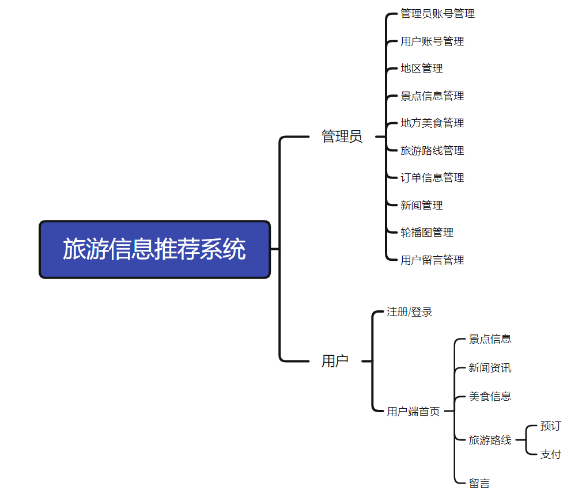

## 技术学习

如果你有任何需求，可以关注本人公众号获取本人联系方式进行咨询。 
公众号内还有更多项目供你选择。 

## 技术服务

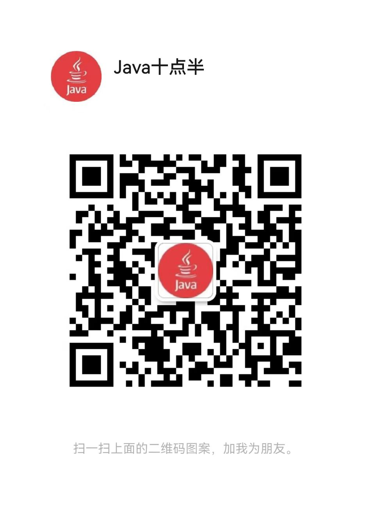

## 技术栈

| 工具及技术             | 版本    |
| ---------------------- | ------- |
| idea                   |         |
| JDK                    | 1.8     |
| SpringBoot             | 2.2.1   |
| MyBatis                | 1.3.2   |
| JWT                    | 3.4     |
| Vue                    | 2.0     |
| ElementUI              | 2.0     |
| MySQL                  | 5.7     |
| Node                   | v16.16.0|

## 系统图片

#### 1.登录页
 
#### 2.景点信息管理
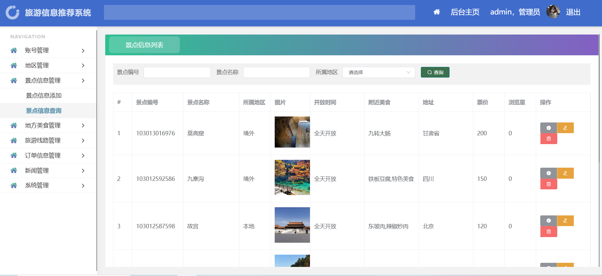 
#### 3.地方美食管理
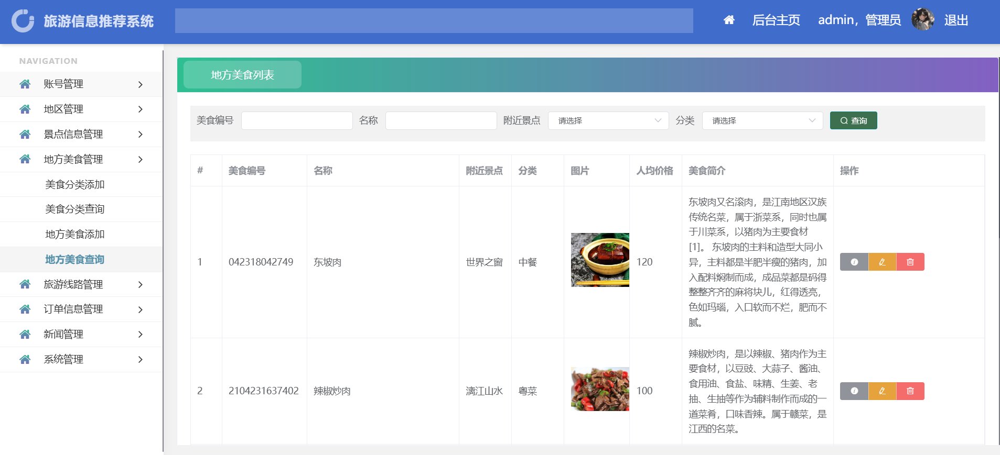 
#### 4.旅游路线管理
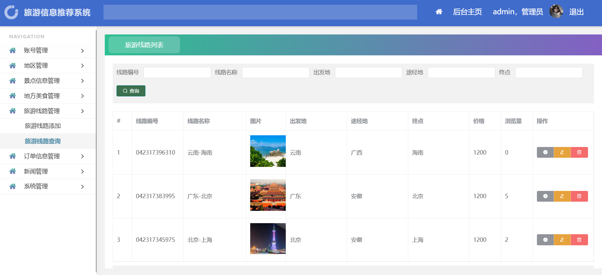 
#### 5.新闻管理
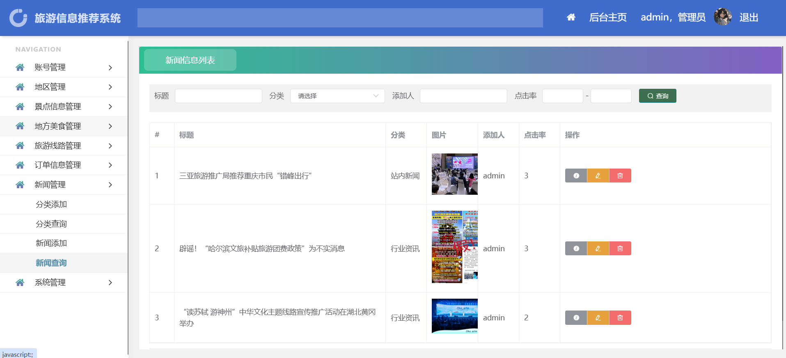 
#### 6.轮播图管理
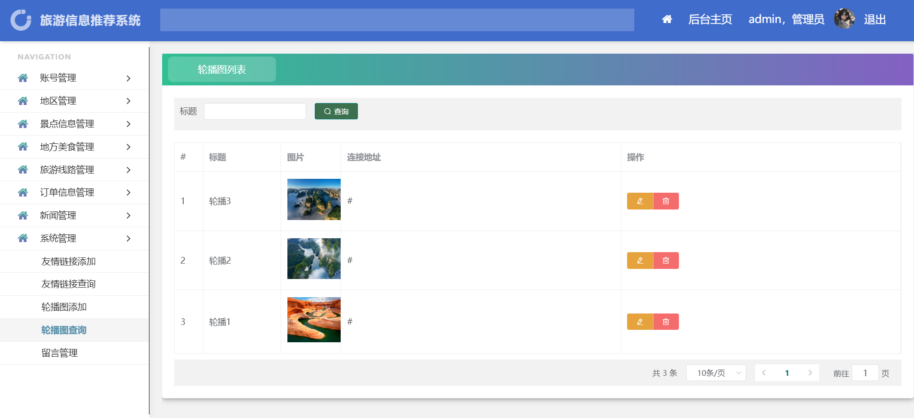 
#### 7.用户预定旅游路线
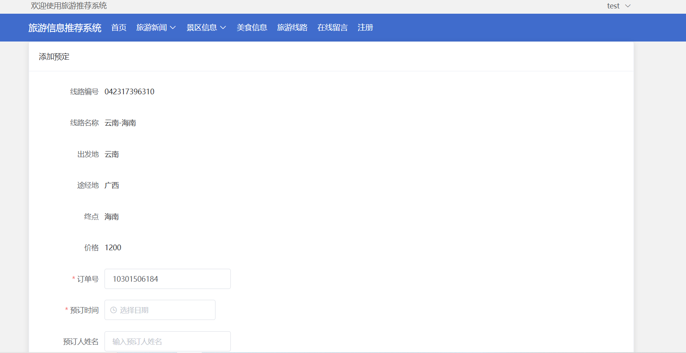 
#### 8.用户支付
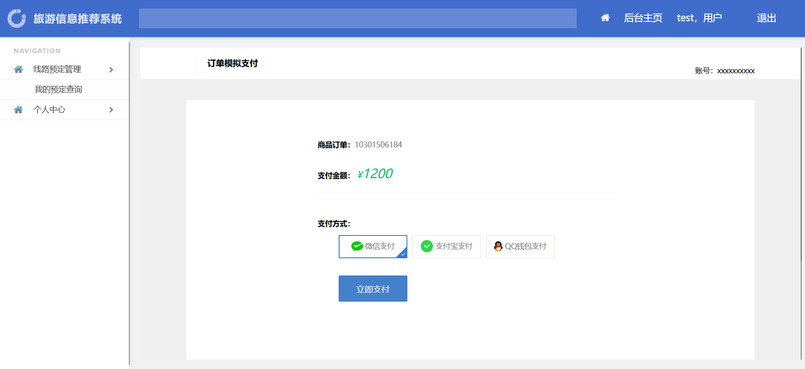 
#### 9.用户端首页
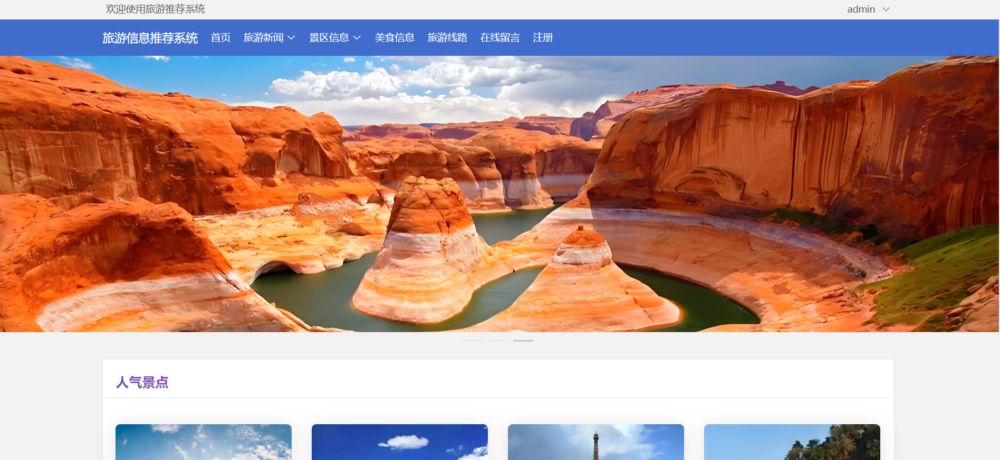 
#### 10.景点信息
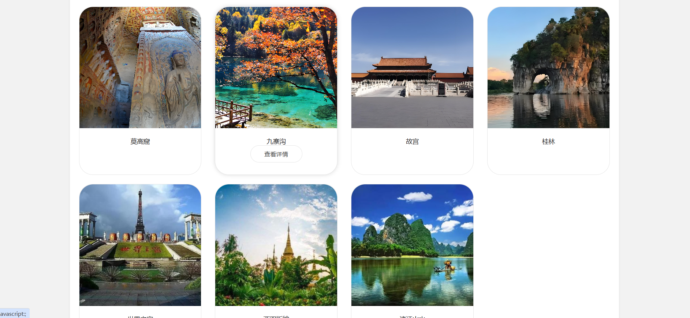 
#### 11.新闻资讯
 
#### 12.用户添加留言
 

